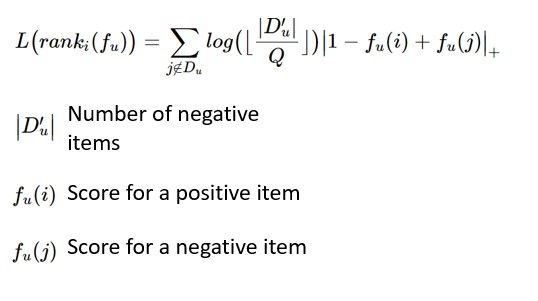
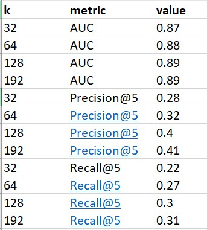

# Capstone project for Machine Learning Engineer Bootcamp at FourthBrain

Industry sponsored project from GroupBy, an e-commerce start up that aims to create highly converting and relevant site experience to maximize revenue through e-commerce channels

# Problem Statement

Online shopping offers millions of items for users to choose from, but with limited attention span and limited real estate space, it becomes necessary to handle information overload. Recommendation system can solve the problem by ranking and recommending top items based on users' preference. It is also reported that 35% of Amazon’s revenue comes from its recommendation engine [link]( https://rejoiner.com/resources/amazon-recommendations-secret-selling-online/)

# Data

GroupBy has provided its internal data (raw data not shared on GitHub) that contains customer product interaction data where there is information on the interaction with an item (search, view, add to cart, or purchase), as well as product brand, and price collected over 1 day. 

A user-item matrix is created that contains 44,588 users and 17,480 products, with 1M interactions. The interaction is a binary 1 or 0 that indicates whether the user purchases the item or not. This is a form of implicit feedback where user's preference for an item is indirectly inferred from behavior patterns versus explicit feedback where the user gives a rating of the product.

The dataset is randomly split based on interactions into train and test sets, 80% and 20% respectively. All users and items are in train and test sets but 20% of the interactions are masked from the training set. There might not be any interaction for a user in the train set and the items recommended is compared to the items purchased in the test set to evaluate model performance.

# Algorithm

Collaborative Filtering Matrix Factorization (MF) is used where an mxn matrix (m: number of users, n: number of items) is decomposed into mxk user factor and kxn item factor. The factors are multiplied to get the score for an item for a particular user. The figure below illustrates the matrix factorization. k represents the number of latent factors, or dimensions.

Figure 1: Illustration of Matrix Factorization Algorithm

LightFM package [link](https://making.lyst.com/lightfm/docs/home.html) is used to perform MF. A common loss function for MF is mean square error where the gradient updates to minimize the difference between actual and predicted scores. Such technique is common for explicit feedback data. For this dataset that consists of implicit feedback, ranking of items, where a purchased item ranks higher than a non-purchased item, are of interest. Hence, weighted average ranking pairwise (WARP) loss [link](http://www.thespermwhale.com/jaseweston/papers/wsabie-ijcai.pdf) is used as the loss function. For each user, there is a pair of positive and negative items. A positive item indicates that the user has purchased the item and a negative item indicates that the user has not purchased the item. The loss function only updates when the rank of a negative item exceeds that of a positive item. This approximates a form of active learning that yields a more informative gradient update, where the model samples the number of negative items Q times until the rank of a negative item exceeds that of a positive item. The loss function is described below.

Figure 2: WARP loss function

# Results

The important parameter to tune is k, the number of dimensions. The table below shows model performance with different values of k:

Table 1: Model performance in different dimensions

128 dimension is selected as model performance starts to plateau.

AUC measures the probability that a randomly chosen positive example has a higher score than a randomly chosen negative example.

Precision@5 measures the fraction of items bought out of the 5 recommended items

Recall@5 measures the number of items bought in the top 5 recommendations divided by the total number of items bought

For a demo, the model can be served as an API using Flask. To deploy on AWS Elastic Beanstalk, follow instructions in the [link](https://docs.aws.amazon.com/elasticbeanstalk/latest/dg/create-deploy-python-flask.html), when in the folder ./recdeployment.

# Findings

- As number if items recommended increases, precision decreases and recall decreases
- Filtering the data to a specific brand improves model performance, precision increases by 38% and recall increases by 43%
- Filtering the data to a cheaper price range worsens model performance. Analysis shows that customers take more sessions to purchase cheaper items compared to expensive items, which could explain why model performance worsens
- The algorithm is also tested on public Kaggle cosmetics dataset that has 1.6M users and 23k items collected over 5 months. Model performance worsens in the public dataset as there might be too many items to choose from.

# Future improvements

Include item (brand, price) and user (location, time of day) specific features into the recommendation to solve the cold start problem.
